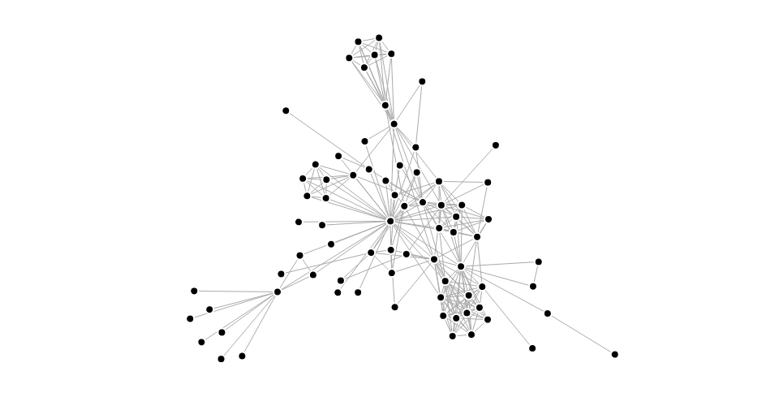

# The Database

The database is what we use to persist data. This can be user created data such as blog posts or data generated by our own code such as analysis or computed values.

There are many database vendors to choose from and many database types some of which we'll briefly talk about here. All have the common goal though to be able to store and retrieve data for our application to use.

## Connecting

In our example application we create a connection to the DB in `index.js`. Our connection gets created once when our backend server starts and a reference to the connection is stored and that same connection is used when each endpoint is called.

Different databases will have different packages and options to create connections but for our example you'll see we require `mongodb` and use the `MongoClient.connect` method.

Mongo performs better by sharing a connection so reusing one between all endpoints is preferential but other databases may not have the same characteristics so be sure to read the docs for the database and package you use to connect beforehand. Some databases may not need a connection created at all. As an example Amazons DynamoDB which is accessed via a REST API so each time you need access you don't create a connection and query it but rather build up a new API request with your credentials and what you want to query or insert right when you need it. This could be something very useful if your backend stack uses a serverless architecture but thats out of scope for now.

## Why Use Databases

This one on the surface it pretty simple. Our applications usually want to be able to store some stuff and then later retrieve what we stored. However we could just have our backend write things we want to persist to a file and then read the file when we want to get our data again. Simple, we persisted data and can look at it when we need it.

The reason we use databases is that the above solution is not very scalable at all. Databases allow us to store our data in an organized way in tables or collections. Many databases allow validation of data before its stored by specifying rules in the database schema such as should a certain attribute or field have a maximum length or should it be a certain type like a date. Getting data from databases is much more robust with very well defined query languages allowing us to get, filter and manipulate data we want to read efficiently.

## Database Types

There are a few main database types and each type implemented by many vendors each having different benefits and weaknesses. The right database to use is very much dependent on your application and the data it needs to store.

### Schema

#### Examples

* Postgres
* MySQL

#### About

Databases such as SQL based ones like MySQL or Postgres define a schema that describe its structure. Tables and the fields in them are defined with rules that are very structured. The benefit of this you can be very certain the data is stored in the format you expect. Also because it is so structured joining data over tables can be done efficiently so having one table of users and another of objects belonging to a user (one to many relationship) you can query user data and all objects that belong to them quickly in a single atomic transaction.

A negative side to all this structure is if your application changes and storage needs change you have to update your schema each time to match. If you want to start storing gender for your users but don't have that field in your user table you need to add it. With more complex changes this can become increasingly difficult to manage and be backward compatible with the data you already have.

### Schemaless

#### Examples

* MongoDB
* DynamoDB
* PouchDB/CouchDB

#### About

Schemaless databases attempt to solve the problem of the rigidity that databases with schemas enforce. Mongo the schemaless database we use in our example. Tables are called collections and instead of storing set fields each store JSON objects of any structure. Some users may have a gender attribute some may not as its never defined in a schema mongo won't care. This makes updates to the application usually not need any changes to the database as it will accept new or missing attributes.

The downside to this is validation is much weaker. Indexes can define unique keys but most of the validation is left to your application logic not the database. Also while joining data between tables is simple and can be done in a single transaction in schema databases in schemaless there is no such thing as joins. To join you need to query one collection and then the second and let your application logic join the data. For this reason schemaless tend to store relationships between objects by simply nesting them in one document in a single collection. For example a users todo list items may be stored as an array in the users object instead of all todo items in a todos table/collection.

### Graph Databases

#### Examples

* neo4j

#### About

Graph databases try to solve the issue of many to many relationships and quickly finding related data multiple levels down. An schema databases are very good at one to one and one to many relationships such as a user has many todo items but a todo item only belongs to one user. However things get complex when we try to describe many to many relationships. A user may have many friends and those friends may have many other friends.

Graph databases allow you to store relationships between resources and query linked items and linked items multiple levels down quickly and effectively. This makes things like finding friends of friends, friend suggestions and so on much simpler to code in your application.

## More Reading

This is just the very tip of the iceberg of databases. There are other types and examples with varying benefits. Its worth researching and trying many databases to see how they work with the application you want to build.